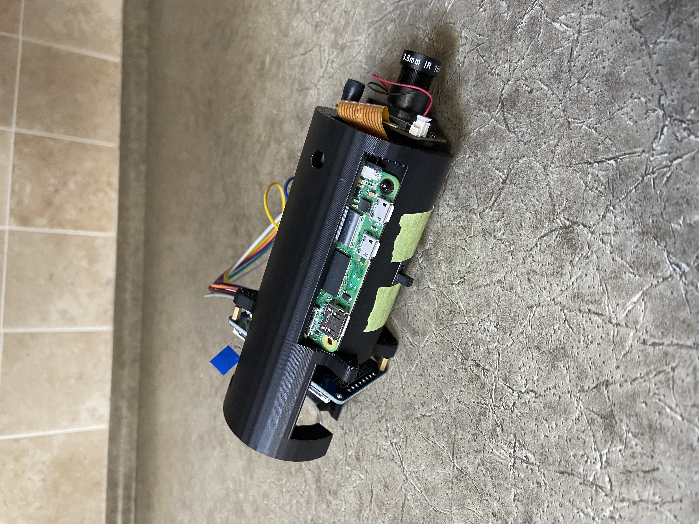

# Night Vision Monocular

This repository contains the details required for another person to replicate this night vision monocular.  

# Background

My goal for this project was to design a low budget digital night vision monocular. I wanted it to be similar in size to a PVS-14 and to mount to a FAST helmet with standard night vision mounting technology.

Military grade analog night vision monoculars cost thousands of dollars, and decent digital night vision costs a few hundred dollars. Most of the digital night vision monoculars that are available are awkward and bulky and are only suitable for handheld use. 

# Parts List

This list includes all of the parts required to build the monocular and links for where I bought them.

### Night Vision Monocular

- Raspberry Pi Zero 2 W | https://leeselectronic.com/en/product/160225-raspberry-pi-zero-2-w.html
- Dorhea Raspberry Pi Camera Module | https://www.amazon.ca/Dorhea-Raspberry-Camera-Automatic-Adjustable/dp/B07DNSSDGG/ref=sr_1_9?crid=24WEDRXG447WV&keywords=Raspberry%2BPi%2B5MP%2BNight%2BVision%2BCamera%2BBoard&qid=1700793495&sprefix=raspberry%2Bpi%2B5mp%2Bnight%2Bvision%2Bcamera%2Bboard%2Caps%2C139&sr=8-9&th=1
- Waveshare 2” LCD Display Module | https://www.amazon.ca/dp/B0CY7X8TWB?psc=1&ref=ppx_yo2ov_dt_b_product_details
- DC 3.7V 3000mAh LiPo Battery | https://www.amazon.ca/dp/B091Y3TW9F?ref=ppx_yo2ov_dt_b_product_details&th=1
- MT3608 Boost Converter | https://www.amazon.ca/dp/B083DNDDBJ?ref=ppx_yo2ov_dt_b_product_details&th=1
- TP4056 Charging Module | https://www.amazon.ca/dp/B06XNXHY6W?psc=1&ref=ppx_yo2ov_dt_b_product_details
- 1.6” Raspberry Pi Zero Camera Cable | https://www.amazon.ca/dp/B0B33YCSY2?psc=1&ref=ppx_yo2ov_dt_b_product_details
- Biconvex 34mm Diameter 45mm Focal Length Lens | https://www.amazon.com/dp/B074WPTTX8?psc=1&ref=ppx_yo2ov_dt_b_product_details
- M2 Machine Screw (10) | https://www.amazon.ca/dp/B0C3926M1B?ref=ppx_yo2ov_dt_b_product_details&th=1
- M6xH10 Brass Threaded Insert | https://www.amazon.ca/dp/B0CNRSJ1B2?psc=1&ref=ppx_yo2ov_dt_b_product_details
- 3 Pin Slide Switch | https://leeselectronic.com/qc/product/3121-3121SLIDESWITCHMINI3PINSS12F15GS.html
- 4 Pin Tactile Button Switch

### Mounting Parts

- G24 | https://www.amazon.ca/dp/B0BB1W5HB7?ref=ppx_yo2ov_dt_b_product_details&th=1&psc=1
- J Arm | https://www.amazon.ca/dp/B0CBD8Y6ZL?ref=ppx_yo2ov_dt_b_product_details&th=1&psc=1

### IR Light and Mount

- 850nm IR Flashlight | https://www.amazon.com/dp/B016ZPH470?psc=1&ref=ppx_yo2ov_dt_b_product_details
- 1” Light Mount | https://www.amazon.ca/dp/B085XY8243?psc=1&ref=ppx_yo2ov_dt_b_product_details

Choice of helmet and other accessories is up to you — any helmet with a shroud mount works.

# Software Setup

### Raspberry Pi Setup

General instructions for setting up your Raspberry Pi can be found [here](https://www.raspberrypi.com/documentation/computers/getting-started.html). For compatibility with the screen driver and camera interface, select this operating system in the imager. 


I recommend setting up your Raspberry Pi as a headless computer so that you don’t need extra peripherals (and the Raspberry Pi Zero doesn’t have HDMI or USB). If you choose a headless setup, when installing the OS enable SSH and configure wifi. Use PuTTY to connect to the Raspberry Pi with the hostname that you configured, and sign in with your username and password. To get the IP address of your Raspberry Pi, run `ifconfig` in the terminal and look next to inet. Follow [this](https://www.youtube.com/watch?v=psy6oZ5pVVo) guide to set up VNC Viewer for remote desktop access. Note: VNC viewer is optional for if you want to control your desktop, but all of the setup can be done via the PuTTY terminal. 

After it is set up, run `sudo apt update` to update packages.

### Screen Driver

fbcp-ili9341 is an optimized display driver that utilizes adaptive display stream updates and other optimizations to squeeze the highest fps possible out of SPI screens. See the [README](https://github.com/juj/fbcp-ili9341) for full details. You can refer to the README for installation and setup instructions, or you follow the steps laid out below. 

[This](https://www.youtube.com/watch?v=KciKqGX8g94) guide shows how to set up the driver. Because our screen has a ST7789VW driver chip, use -DST7789VW=ON instead of -DST7789=ON in the cmake line. Your cmake line should look like this:

`cmake -DST7789VW=ON -DGPIO_TFT_DATA_CONTROL=25 -DGPIO_TFT_RESET_PIN=27 -DSPI_BUS_CLOCK_DIVISOR=8 -DSTATISTICS=0 ..`

`-DSPI_BUS_CLOCK_DIVISOR=even_number` sets the clock divisor number, where `SPI_frequency = core_freq/divisor`. Try a larger value if the display shows corrupt output, or a smaller value to get higher bandwidth. Check `/boot/config.txt` for core_freq.

Raspberry Pi's vc4-kms-v3d will cause fbcp to fail, so you need to block vc4-kms-v3d in `/boot/config.txt`. To do that type `sudo nano /boot/config.txt` in the terminal and comment out the two lines shown:


Then reboot (`sudo reboot`).

After completing these steps, you should be able to see your desktop when you power on the Pi.

Documentation: 
- Screen Documentation | https://www.waveshare.com/wiki/2inch_LCD_Module#Download_Examples
- Driver | https://github.com/juj/fbcp-ili9341

### Camera Interface

This project uses MMAL to interface with the camera. MMAL (Multi-Media Abstraction Layer) is a framework which is used to provide a host-side, simple and relatively low-level interface to multimedia components running on VideoCore. It also provides a component interface so that new components can be easily created and integrated into the framework.  

Start by switching your Raspberry Pi to the Legacy Camera Stack and disabling Raspberry Pi desktop. Type `sudo raspi-config` in the terninal and enable legacy camera support in the interface settings. Also disable the Raspberry Pi desktop by navigating to System > Boot / Auto Login and selecting Console Autologin (so that you can write to the framebuffer without the desktop interfering). 

Installing core libraries for interfacing with the camera:

```bash
sudo apt install snapd
sudo reboot
sudo snap install core
sudo snap install rpi-userland --edge
```

If you didn't already install cmake, run `sudo apt install cmake`.
Next run these lines:

```bash
git clone https://github.com/raspberrypi/userland.git
cd userland
./buildme
```

Finally, you need the code for writing to the framebuffer.

```bash
git clone https://github.com/Egray180/night-vision-monocular.git
cd night-vision-monocular
make
```

To run the code, type `./camera` in the terminal. To make the code start automatically, insert `/home/your_username/night-vision-monocular/camera` at the bottom of `/etc/rc.local` (edit with `sudo nano /etc/rc.local`).

Documentation:
- MMAL | http://www.jvcref.com/files/PI/documentation/html/

### Power Button

Removing power from the Raspberry Pi while the SD card is being accessed can (under certain circumstances) corrupt your memory. I implemented a button that safely shuts down the Raspberry Pi that I can press before removing power with the power switch. This means that turning off the device is a two stage operation — press the power button and wait for the green ACT light to turn off, then hit the power switch. In my experience, removing power without safely shutting down the Pi (with sudo shutdown command or similar) did not do any damage, but I added this feature to remove the risk.

To add this feature, connect a button between pin 29 (GPIO 5) and pin 30 (Gnd) and add `dtoverlay=gpio-shutdown,gpio_pin=5` at the bottom of `/boot/config.txt`.

[This](https://raspberrypi.stackexchange.com/questions/50345/is-it-okay-to-just-pull-the-plug) forum has some detailed answers about the risk of unplugging your Pi.

# Build and Assembly

### Electronics

In general, use your best judgment when selecting wire lengths and directions. Use best practices when soldering and use heat shrink to protect connections where necessary. 

Solder the screen to the Pi as shown below, with the wires going out the bottom of the Pi perpendicular to its surface.


Solder the push button between pin 29 (GPIO 5) and pin 30 (Gnd) and use longer wires (~10cm) so that you can feed them out of the housing through the front. 
Solder everything else as follows:


Before you add the battery, plug in the TP4056 (Micro USB) and use a multimeter to measure the voltage across VOUT+ and VOUT-  and adjust the potentiometer on the boost converter until it is 5V. 

Solder VOUT+ on the boost converter to the +5V pad and VOUT- to the GND pad. Use longer wires for these connections so that you can move these components around in the housing (because the Pi is fixed). Solder these wires on the Pi so that they point away from the camera port.


### Assembly

All of the SolidWorks and STL files for the project are in the housing-files branch. 

First, see the pictures of the assembled device in the results section to get a general idea of the way things are meant to go. Second, thread all of the holes by turning M2 screws into them. The holes are sized such that this should work well, but you might need to drill them slightly. Feed everything through the slot in the housing where the Pi sits, starting with the battery and the power circuit boards. Feed the screen wires through the screen wire slot. Once everything is inside, screw the Pi down with 2 M2 screws. Feed the switch through the switch slot (slot is wide enough if you turn the switch sideways) and seat in the housing. Slide the battery into the battery tray, and push the power circuit boards into the space between the battery tray separator and the Pi. Screw the screen in and plug in the wires. The screen should come with spacers which you will need to use. I used M2x12 screws for the screen (the screws that it came with were too short). You can use the spacers to adjust the distance from the lens to the screen until it is clear. Screw the camera into the front of the housing with spacers (I used M3 nuts) because the back of the camera is not flat and cannot sit flush against the surface of the housing. Connect the camera cable (the wire side should face the circuit boards). Finally, glue the lens into the housing with super glue. 

I put strips of foam tape in the battery compartment and on the back of the screen so that the battery does not move. If you want to make sure that the IR filter on the camera never comes on, cover the sensor with opaque tape. 

# Results

The monocular works well in the dark and the unit cost is around $150. Here are photos of the monocular working in my basement when it was pitch black:


The lens significantly degrades the quality of the image on the screen, which is one of the items that I want to address. In any case, the monocualar functions well with the IR Flashlight and allows me to see in dark environments. 

More photos:




# To Do

The following improvements could be made:
- Improve lens setup for clearer image
- Add eyecup
- Cover openings in housing
- Seal housing to make device water resistant

# Contact
Created by [@EthanGray](https://github.com/Egray180) - feel free to contact me at egray180@student.ubc.ca
